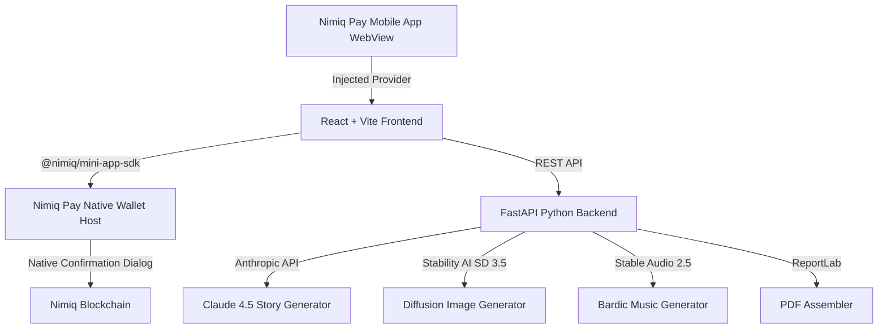

# 🎨 Bardtale AI — Nimiq Pay Mini App

> **Commission AI Storybooks, Custom Artworks & Witcher-Style Bardic Ballads Directly Inside Nimiq Pay**

[](https://nimiq.com)
[](https://fastapi.tiangolo.com/)
[](https://react.dev/)
[](https://www.typescriptlang.org/)

**Bardtale AI** is a full-stack Nimiq Pay Mini App that allows creators to commission personalized, AI-illustrated storybooks and Witcher-style fantasy music ballads using NIM payments. The application integrates directly with Nimiq Pay's injected provider and `@nimiq/mini-app-sdk` for seamless wallet connection, device-scoped session tracking, and payment-gated AI pipelines.

---

## ✨ Features

- 📖 **Personalized AI Storybooks**: Enter character names, themes, and special details to generate custom story scripts with matching digital watercolor illustrations.
- 🎵 **Bardic Music & Story Ballad Studio**: Powered by **Stable Audio 2.5**, compose authentic Witcher-style tavern songs, minstrel ballads, and fantasy soundscapes up to 3 minutes in 44.1kHz stereo.
- ⚡ **Payment-Gated AI Pipeline**: Server execution of Anthropic Claude 4.5, Stable Diffusion 3.5 Large Turbo, and Stable Audio 2.5 is strictly gated behind verified NIM transactions.
- 🛡️ **Native Nimiq Pay SDK Integration**:
  - **Provider Connection**: Native `init({ timeout: 10000 })` connection helper.
  - **Device Scoped ID**: `requestDeviceIdentifier` for persistent order history without login credentials.
  - **Locale Aware**: Reads `window.nimiqPay.language` for localized UI text.
  - **Wallet Operations**: `listAccounts()`, `sendBasicTransactionWithData()`, and `sendBasicTransaction`.
- 📚 **Multi-Tier Commission Options**:
  - **Mini Story** (500 NIM): 3 pages, 1 custom cover artwork.
  - **Standard Story** (1,500 NIM): 5 pages, 3 rich illustrations.
  - **Deluxe Edition** (3,000 NIM): 8 pages, full artwork on every page.
  - **Bardic Song** (2,500 NIM): Custom 44.1kHz stereo MP3 music track via Stable Audio 2.5.
- 📄 **PDF Export**: Assembles and downloads a print-ready PDF storybook.
- 🎵 **In-App Audio Player**: Features an interactive audio waveform visualizer and 1-click MP3 download.
- 📱 **Collapsible Sidebar Navigation**: Mobile-optimized slide-over menu drawer for quick navigation inside Nimiq Pay.
- 🧪 **Browser Dev Sandbox**: Automatic fallback simulation mode for testing in standard web browsers outside Nimiq Pay.

---

## 🛠️ Architecture & Tech Stack



- **Frontend**: React 19, TypeScript, Vite, Lucide Icons, Canvas Confetti.
- **Backend**: FastAPI, PyPDF / ReportLab, SQLite, Uvicorn.
- **SDK**: `@nimiq/mini-app-sdk` v0.1.0+.
- **AI Models**: Anthropic Claude 4.5 Haiku (Scripting), Stable Diffusion 3.5 Large Turbo (Illustrations), Stable Audio 2.5 (Music).

---

## 🚀 Quick Setup & Installation

### Prerequisites

- **Node.js**: `v18.0.0` or higher
- **Python**: `v3.10` or higher
- **NPM** or **PNPM**

### 1. Clone the Repository

```bash
git clone https://github.com/your-username/bardtale-ai-mini-app.git
cd bardtale-ai-mini-app
```

### 2. Configure Environment Variables

Create or update the `.env` file in the project root:

```env
# AI Pipeline API Keys (Optional for live generation; mock mode activates if omitted)
ANTHROPIC_API_KEY=your_anthropic_api_key_here
STABILITY_API_KEY=your_stability_api_key_here

# Nimiq Pay Configuration
NIMIQ_NETWORK=testnet
RECEIVER_WALLET_ADDRESS=NQ07 0000 0000 0000 0000 0000 0000 0000 0000
```

---

### 3. Start Backend Server

```bash
cd server
python3 -m venv venv
source venv/bin/activate  # On Windows: venv\Scripts\activate
pip install -r requirements.txt
uvicorn main:app --reload --port 8000
```

The backend server will run at: `http://localhost:8000` (API documentation at `http://localhost:8000/docs`).

---

### 4. Start Frontend Client

In a new terminal window:

```bash
cd client
npm install
npm run dev -- --host
```

Vite will output local and network URLs:

```text
  VITE v6.4.3  ready in 320 ms

  ➜  Local:   http://localhost:5173/
  ➜  Network: http://192.168.1.42:5173/
```

---

## 🚰 How to Get Testnet NIM for Testing

To test transactions inside **Nimiq Pay** on the Nimiq Testnet, follow these steps to obtain free Testnet NIM:

### Option A: Using the Nimiq Testnet Faucet
1. Open the official Nimiq Testnet Faucet in your browser:  
   👉 **[https://faucet.nimiq-testnet.com](https://faucet.nimiq-testnet.com)**
2. Copy your Nimiq wallet address:
   - In **Nimiq Pay**, open your wallet to copy your address.
   - Or open the **[Nimiq Testnet Wallet Web App](https://wallet.nimiq-testnet.com)**.
3. Paste your address into the faucet input field and click **Receive Testnet NIM**.
4. You will receive free Testnet NIM instantly to test mini app transactions.

### Option B: Testing in Browser Sandbox Mode
If you run the app directly in a standard web browser (e.g. `http://localhost:5173`), the Mini App SDK automatically activates **Sandbox Dev Mode**:
- Wallet connections and payments are simulated smoothly without needing real or testnet NIM.
- All AI story and music generation steps proceed seamlessly for local UI and backend development.

---

## 📱 Testing Inside Nimiq Pay (Mobile Device)

1. Ensure your mobile phone and development machine are connected to the **same Wi-Fi network**.
2. Run the frontend dev server with network host enabled:
   ```bash
   cd client
   npm run dev -- --host
   ```
3. Copy the **Network URL** displayed in your terminal (e.g., `http://192.168.1.42:5173`).
4. Open **Nimiq Pay** on your mobile phone:
   - Navigate to **Mini Apps**.
   - Enter your network URL: `http://192.168.1.42:5173`
   - Alternatively, open via deeplink:
     ```text
     nimiqpay://miniapp?url=http://192.168.1.42:5173
     ```
5. Tap **Pay NIM via Nimiq Wallet**. Nimiq Pay will launch its native host confirmation dialog to authorize the payment!

---

## 🔌 Nimiq Provider API & SDK References

This mini app follows official `@nimiq/mini-app-sdk` practices:

```typescript
import { init, requestDeviceIdentifier } from '@nimiq/mini-app-sdk';

// 1. Initialize provider connection with 10s timeout
const nimiq = await init({ timeout: 10000 });

// 2. Fetch user's pseudonymous device ID for persistent history
const deviceId = await requestDeviceIdentifier({ 
  reason: 'Illustrated story commissions and session history' 
});

// 3. User language selection injected by Nimiq Pay
const language = window.nimiqPay?.language || 'en';

// 4. Send basic transaction with data memo (Luna conversion: 1 NIM = 100,000 Luna)
const txHash = await nimiq.sendBasicTransactionWithData({
  recipient: 'NQ07 0000 0000 0000 0000 0000 0000 0000 0000',
  value: 1500 * 100000,
  data: 'Bardtale AI Commission #REF12345'
});
```

---

## 📁 Project Structure

```text
bardtale-ai-mini-app/
├── client/                     # React + Vite Frontend
│   ├── src/
│   │   ├── components/         # Header, SidebarNav, MusicStudio, TierSelector, PaymentCard, ProgressTracker, ResultView, BardtaleLogo
│   │   ├── services/           # nimiqSdk.ts (Mini App SDK), api.ts
│   │   ├── App.tsx             # Main Application Flow & Mode Switcher
│   │   └── main.tsx            # Entry Point
│   ├── package.json
│   └── vite.config.ts          # Network host (5173) & Proxy Setup
├── server/                     # FastAPI Python Backend
│   ├── services/               # pipeline.py (Claude & SD 3.5), audio_service.py (Stable Audio 2.5), pdf_service.py
│   ├── config.py               # Tier prices, Stable Audio config, & RECEIVER_WALLET_ADDRESS
│   ├── database.py             # SQLite orders, music_tracks & history persistence
│   ├── main.py                 # FastAPI routes, audio streaming & static server
│   └── requirements.txt
├── .env                        # Environment Configuration
└── README.md
```

---

## 📜 License

MIT License — free for use and adaptation within Nimiq Pay Mini Apps.
